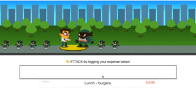
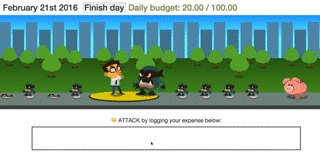

# Inspector Budget

## What is Inspector Budget ?

Inspector Budget is a game that will help you to gain control of your money and organize your finances. Its main goal is to present a fun and dynamic way to keep track of your daily, weekly and monthly budget by mirroring your expenses. Therefore, the better you do on your game, the better you do on your real life.

## How to play?

*Setup*: Log your salary and fixed expenses. After that insert daily, weekly and monthly budgets. They will define your progress during the game.

---

*Input*: You start the game by logging every expense that you have during the day. Every time you insert an amount, you hit the monster.

---

*Weather*: It reflects the progression of your budget. Sunshine for controlled budget. Rain if you spend too much. Talk about Data Visualization!

---

*Monsters*: By putting your mouse course on the monster, you can see more informations about that exact day.

---

*Finish the day button*: just click when you are sure you won’t spend any more money. All inputs are calculated and you won’t be able to add new information.

## What is the idea behind Inspector Budget?

According to Charles Duhigg's bestseller "The Power of Habit", our brains, in attempt to save space and effort, try to transform our daily activities into habits by making it execute them in three steps. The author calls this process “The habit loop”.  The Cue is the first element, the one that triggers the habit. The next one is The routine, the process that we go through in order to achieve our goal. The Reward is the last element of the process, the reason why we began the activity in the first place.
As soon as we are able to define what triggers us to do something and what we expect from this action, we are able to change the routine that leads us to it.

## How does Inspector Budget work?

The game operate as a tool that will assist you to set a habit of controlling the amount and way you spend your money. By logging your outlays, you will be able to keep even those almost insignificant costs always on track, avoiding mysterious holes on your budget and unpleasant surprises on the end of every month.

## Made with :green_heart:

Inspector budget was made as a part of the [hack.summit() Hackathon](http://koding.com/hackathon)

Although it's still a buggy prototype you can [play it here](http://http://169.45.234.115:1983/) and give us your feedback.

Authors:
Edgar Neto
Felix Exner
Olga Santos
Osiris Neto
Tadas Ziemys

License
-------

The MIT License (MIT)

Copyright (c) 2014-2016 Budget Buddies Team

Permission is hereby granted, free of charge, to any person obtaining a copy of this software and associated documentation files (the "Software"), to deal in the Software without restriction, including without limitation the rights to use, copy, modify, merge, publish, distribute, sublicense, and/or sell copies of the Software, and to permit persons to whom the Software is furnished to do so, subject to the following conditions:

The above copyright notice and this permission notice shall be included in all copies or substantial portions of the Software.

THE SOFTWARE IS PROVIDED "AS IS", WITHOUT WARRANTY OF ANY KIND, EXPRESS OR IMPLIED, INCLUDING BUT NOT LIMITED TO THE WARRANTIES OF MERCHANTABILITY, FITNESS FOR A PARTICULAR PURPOSE AND NONINFRINGEMENT. IN NO EVENT SHALL THE AUTHORS OR COPYRIGHT HOLDERS BE LIABLE FOR ANY CLAIM, DAMAGES OR OTHER LIABILITY, WHETHER IN AN ACTION OF CONTRACT, TORT OR OTHERWISE, ARISING FROM, OUT OF OR IN CONNECTION WITH THE SOFTWARE OR THE USE OR OTHER DEALINGS IN THE SOFTWARE.
